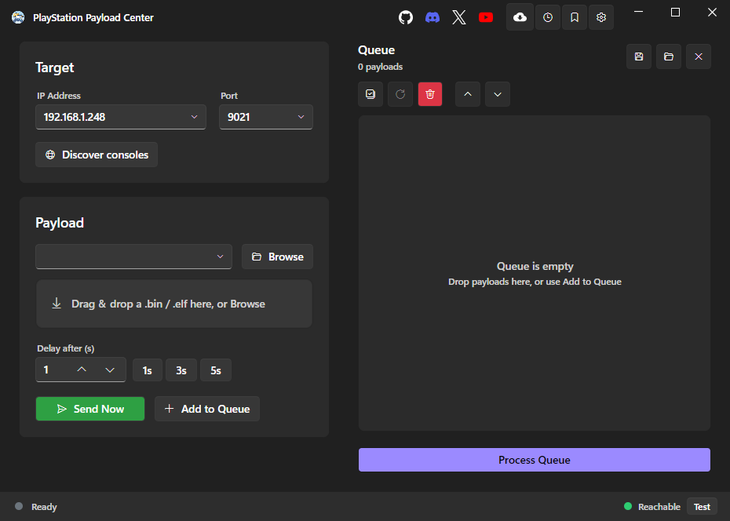

<div align="center">

# PlayStation Payload Center

**Discover, download, verify, queue, and send homebrew payloads to a jailbroken PS4 / PS5 - from one cross-platform desktop app.**




</div>

---

PlayStation Payload Center is a modern, cross-platform desktop tool for the PlayStation homebrew scene. It started life as a simple payload *sender* and grew into a full control center: find your console on the network, browse online payload catalogs, download and **SHA-256-verify** payloads into a local library, build and order a send queue, and stream `.bin` / `.elf` payloads to your console's loader over TCP - all with a clean, fast, fully-localized UI.

It is a **PC-side tool**: your console runs a payload loader that listens, and this app connects and sends. Nothing is installed on your console.

## Download

Grab the build for your OS from the **[Releases page](https://github.com/Pharaoh2k/PlayStation-Payload-Center/releases)**. Every build is **self-contained** - no .NET runtime or other dependency to install.

| Platform | Download |
| --- | --- |
| Windows (x64) | `PlayStation Payload Center 2.0.0 win-x64.zip` |
| Linux (x64) | `PlayStation Payload Center 2.0.0 linux-x64.tar.gz` |
| macOS (Apple Silicon) | `PlayStation Payload Center 2.0.0 osx-arm64.tar.gz` |
| macOS (Intel) | `PlayStation Payload Center 2.0.0 osx-x64.tar.gz` |

### Running it

- **Windows** - unzip and double-click `PlayStation Payload Center.exe`. If SmartScreen warns (the app is unsigned): *More info -> Run anyway*.
- **Linux** - `tar -xzf` the archive, then `./'PlayStation Payload Center'`. The executable bit is preserved. Requires a desktop session (X11 or Wayland).
- **macOS** - `tar -xzf` the archive, then clear the Gatekeeper quarantine (the app is unsigned):
  ```bash
  xattr -dr com.apple.quarantine "PlayStation Payload Center"
  ./"PlayStation Payload Center"
  ```

## Features

### Send
- Stream `.bin` / `.elf` payloads over TCP, chunked, with live transfer progress and cancel.
- One fresh connection per payload (one-shot sends - no lingering connection).
- `Ctrl+Enter` to send, drag-and-drop a file straight onto the window.
- **Target reachability indicator** - a probe tells you whether the console is reachable, reachable-but-loader-not-listening, or unreachable *before* you wait on a send timeout.

### Discover
- Find consoles on your LAN via UDP broadcast (PS4 and PS5).
- One click sets the target IP (your loader port is preserved).

### Queue
- Build a send queue, drag to reorder, set a per-item delay, and watch an **"Up next" countdown** between sends.
- Process the selected items, or all of them if nothing is checked.
- Save and load queues as **playlists**.

### Repository / catalogs
- Add one or more **payload catalogs** (`payloads.json` sources) and browse them in-app.
- **Download + SHA-256 verify** each payload into a managed local library; a bad hash is rejected automatically.
- **Update detection** by base name - newer versions are flagged and pinned to the top, and an update replaces the old file.
- At-a-glance counters for **Local / Remote / Updates**, collapsible per-source catalogs, and clear empty / offline states.
- As a desktop HTTP client it is not subject to browser CORS, so it can consume any catalog.

### Local library
- Everything you download lives in a tidy library - send it now, add it to the queue, or delete it.

### Safety nets
- **Duplicate-by-content** detection (SHA-256) catches the same payload under two different names.
- **Conflict warnings** flag known-incompatible payload pairs in your queue before you send them.

### Activity log
- A persistent log of recent sends - file, target, size, duration, and result.

### Profiles
- Save and reuse console endpoints (name + IP + port).

### Polished, localized UI
- Light / Dark / System themes.
- **13 languages** with **live switching** (no restart): English, Espanol, Portugues (Brasil), Francais, Deutsch, Italiano, Polski, Russian, Turkce, Korean, Japanese, Simplified Chinese, Nederlands.
- Smooth animations, friendly payload-name + version parsing, and a single-page "command center" layout.

### Cross-platform
- Native builds for **Windows, macOS (Intel + Apple Silicon), and Linux**, each a single self-contained file.

## How it works

- **Discovery:** UDP `SRCH` broadcast - PS4 on port **987**, PS5 on **9302**.
- **Sending:** payloads stream over TCP to the loader port (commonly **9020 / 9021**).
- Picking a discovered console sets the **IP only**; your chosen loader port is kept (a console's discovery / host-request port is not the loader port).

## Custom payload repositories

A catalog is a JSON file you host anywhere (GitHub Pages, a static host, your own server). The schema:

```json
{
  "name": "My Custom Payloads",
  "payloads": [
    {
      "name": "FTP Server",
      "filename": "ftpsrv_v0.19.elf",
      "url": "https://example.com/ftpsrv_v0.19.elf",
      "description": "A simple FTP server",
      "version": "v0.19",
      "checksum": "<sha256 hex, 64 chars>"
    }
  ]
}
```

`description`, `version`, and `checksum` are optional; when a `checksum` is present, downloads are verified against it. A bare JSON array of payload objects is also accepted. Add the source URL in **Repository -> Manage sources**.

## Built with

[Avalonia](https://avaloniaui.net/) + [FluentAvalonia](https://github.com/amwx/FluentAvalonia) on **.NET 10**. Published self-contained per platform.

## License

**Copyright (c) 2026 Pharaoh2k. All rights reserved.** See [LICENSE](LICENSE).

The source code is not provided. The binaries are for personal use; redistribution, reverse-engineering, and derivative works are not permitted without written permission.

## Disclaimer

"PlayStation", "PS4", and "PS5" are trademarks of Sony Interactive Entertainment Inc. This is an independent, unofficial tool and is **not affiliated with, endorsed by, or sponsored by Sony**. Use it only with consoles you own and only for lawful homebrew. You are responsible for what you run on your hardware.

## Links

- Discord - https://discord.com/invite/9QDk42Rq8H
- X - https://x.com/_Pharaoh2k
- YouTube - https://www.youtube.com/@Pharaoh2k
- GitHub - https://github.com/Pharaoh2k
